# Pelican Town Specials · 鹈鹕镇新菜单

[English](README.md) | [简体中文](README.zh-CN.md)

> Turn the food you make into Pelican Town's next special.

Upload a photo of a real dish and Pelican Town Specials will turn it into a new Stardew Valley food item, complete with a name, description, ingredients, stats, pixel icon, and preview artwork. When it is ready, you can package it directly as a Content Patcher mod.

The app runs locally on Windows. Download it and start creating—no Python, Node.js, or other development tools required.

## Download and launch

Open the [latest release](https://github.com/ConstantlyGrowup/pelican-town-specials-stardew-mod/releases/latest) and choose one of these options:

- Download `PelicanTownSpecials-Setup-vX.X.X.exe`, follow the installer, and launch the app from its shortcut.
- Or download `PelicanTownSpecials-windows-x64-vX.X.X.zip`, extract it, and double-click `PelicanTownSpecials.exe`.

The app opens in your browser automatically. Drafts, cookbook entries, images, and export history stay in your local workspace:

```text
%LOCALAPPDATA%\PelicanTownSpecials\workspace
```

## Try it first, or configure your own AI service

If you are not familiar with APIs yet, open Settings and click **Try it without configuring anything**. The shared trial includes two complete generations. A trial use is counted only after the full generation succeeds, and the result page shows how many uses remain.

If the trial service is temporarily unavailable, you can retry or switch to your own service without losing that trial use.

To use your own service, open **Settings** and enter:

- **Base URL**: use `https://api.openai.com/v1` for the official OpenAI API, or the URL supplied by your compatible gateway.
- **API Key**: the key issued by that service.
- **Text, vision, and image model IDs**: the model names actually supported by your service.

The project has verified the following official OpenAI configuration:

```text
Base URL:    https://api.openai.com/v1
Text model:  gpt-5.6
Vision model: gpt-5.6
Image model: gpt-image-2
```

Model availability differs between services. If you use a compatible gateway, follow its documentation for the correct model IDs.

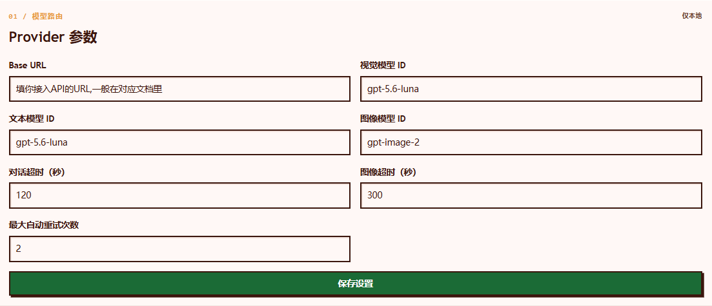

## Create a dish

After uploading a photo, choose **Ask Gus** or **Blueprint Mode**. Both modes create a pixel icon and a complete preview, but they give you different levels of control over the dish itself.

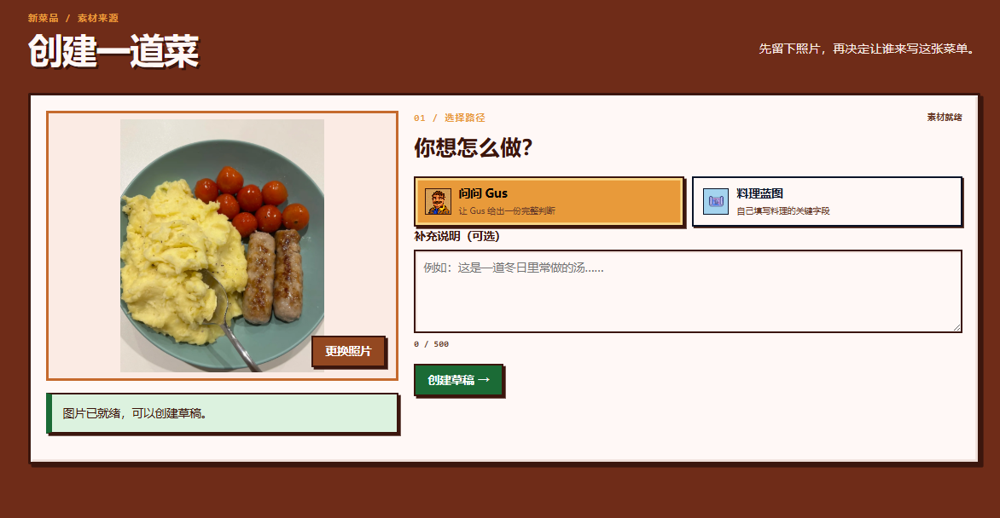

### Ask Gus

Choose this when you want to see how Gus interprets your dish.

1. Upload a photo.
2. Optionally add some context, such as “My mother makes this soup every winter solstice.”
3. Start generation and let Gus analyze the dish, adapt it to the game, and create the artwork.

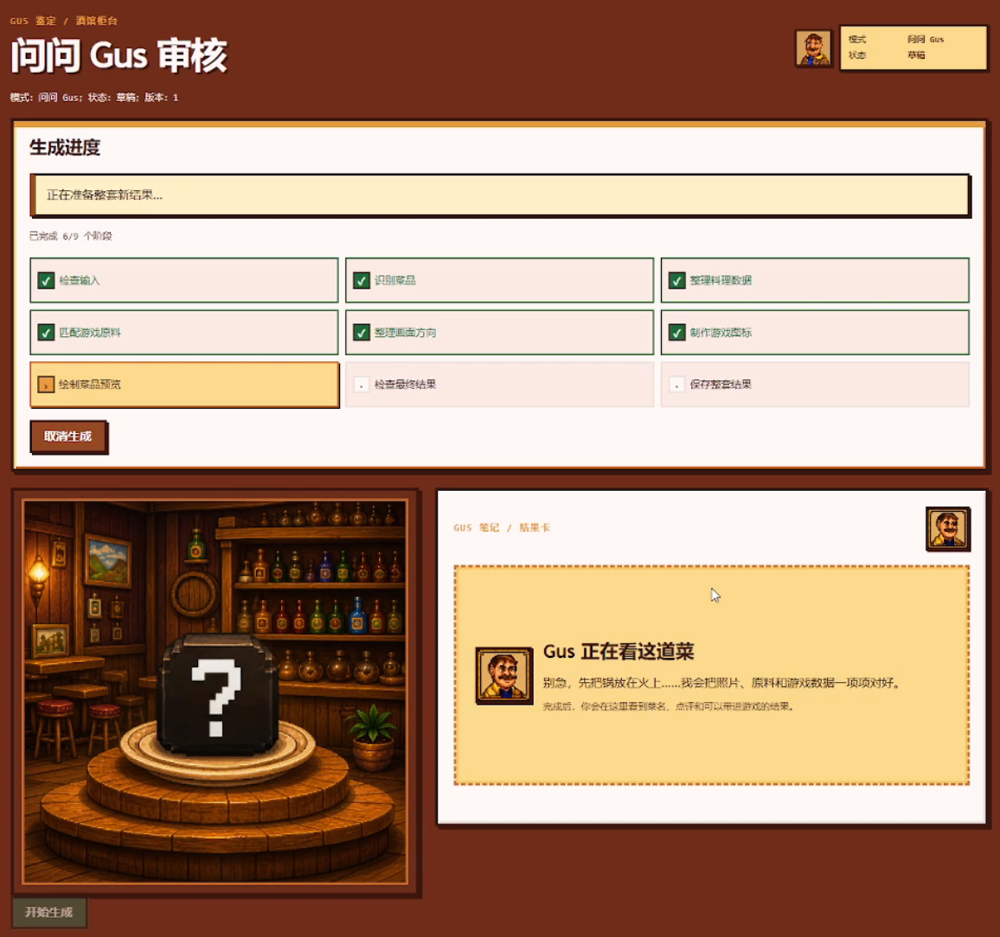

When generation finishes, you can:

- **Accept and add to Cookbook** to save the result.
- **Regenerate everything** to create a completely new version.
- **Reject draft** to discard it.

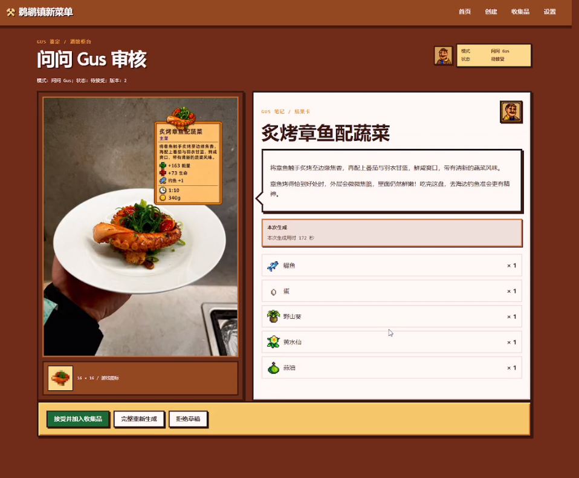

Generation continues on the local backend. You can refresh the page or visit another page and return without losing progress. Up to three generation tasks can run at once; if all slots are occupied, wait for one to finish and try again.

### Blueprint Mode

Choose this when you already know what the dish should be called and which ingredients and stats it should use.

You can set the display name, internal name, category, description, tags, ingredients, recovery values, price, and beverage type. The AI then uses those details and the original photo to create the pixel icon and preview artwork.

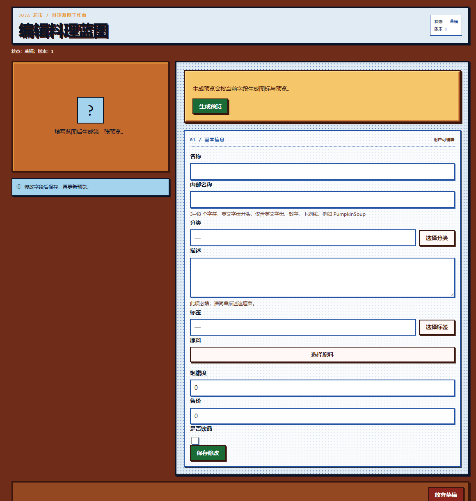

After changing dish fields, regenerate the preview so the artwork matches the latest values. Once saved, the dish appears in your Cookbook.

## Cookbook

Every accepted dish appears in the **Cookbook**.

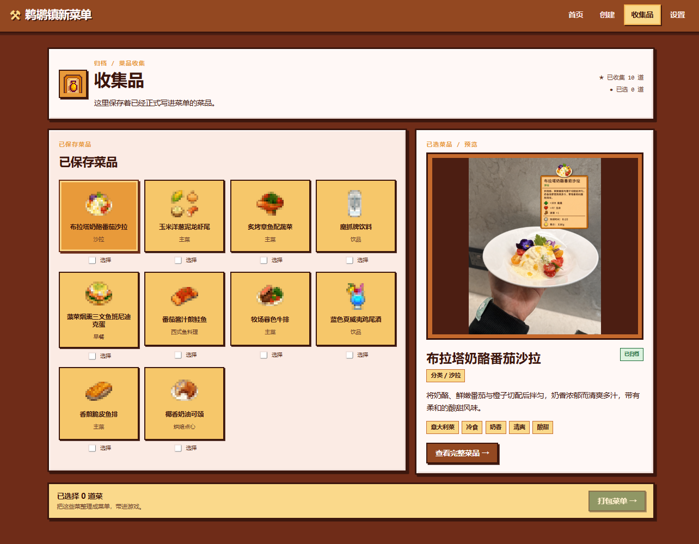

Open a dish to see its full details. Cookbook entries are kept as finished records; if you want a different design, create a new draft.

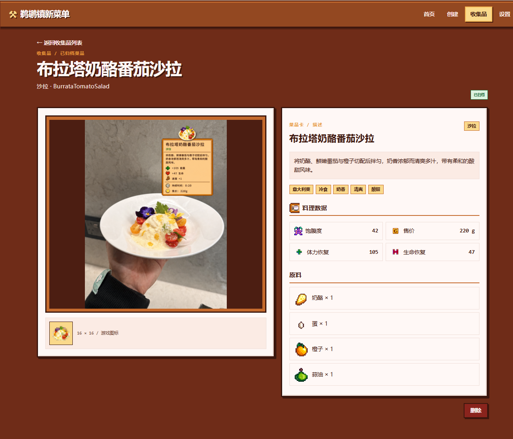

## Pack the Menu

To bring dishes into the game, select one or more Cookbook entries and click **Pack the Menu**.

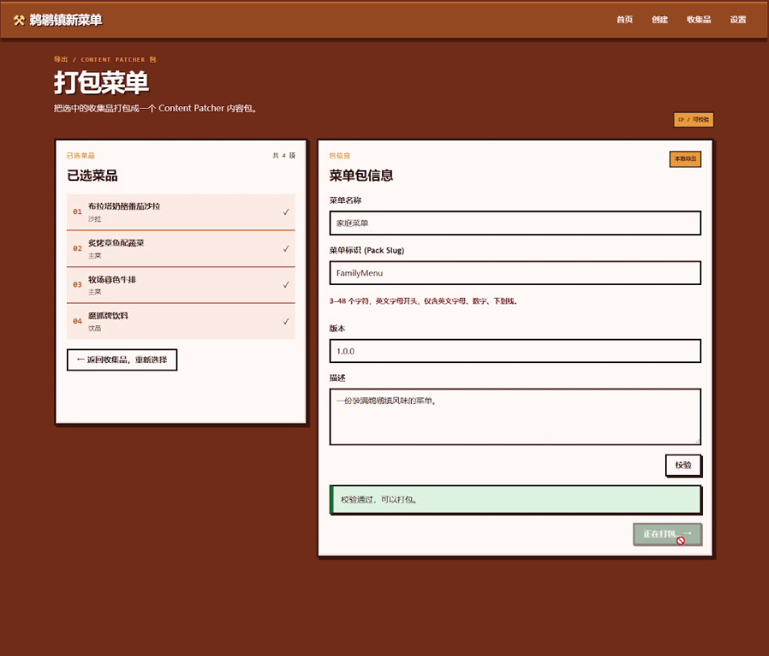

Enter a menu name, menu ID, and version. Run validation, then build the package. The app will produce a mod ZIP.

Menu IDs may contain letters, numbers, hyphens, and underscores. For example:

```text
FamilyMenu
pelican-specials
```

## Bring It In-Game

Install these first:

- [SMAPI](https://smapi.io/)
- Content Patcher 2.9.0 or later

Then:

1. Download the generated mod ZIP.
2. Extract it into Stardew Valley's `Mods` folder.
3. Make sure the extracted `[CP]` folder sits directly inside `Mods`, without an extra wrapper folder.
4. Launch the game through SMAPI.

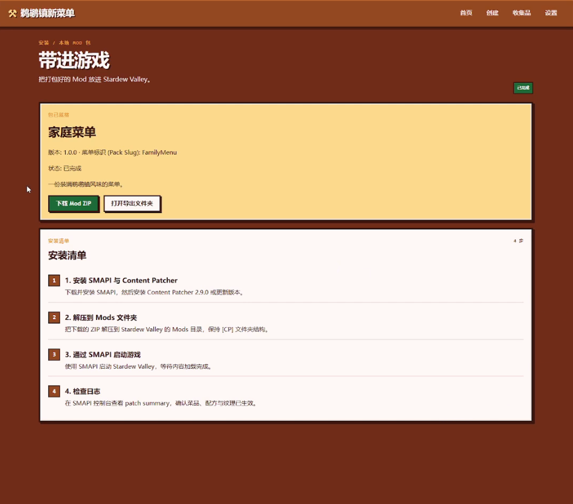

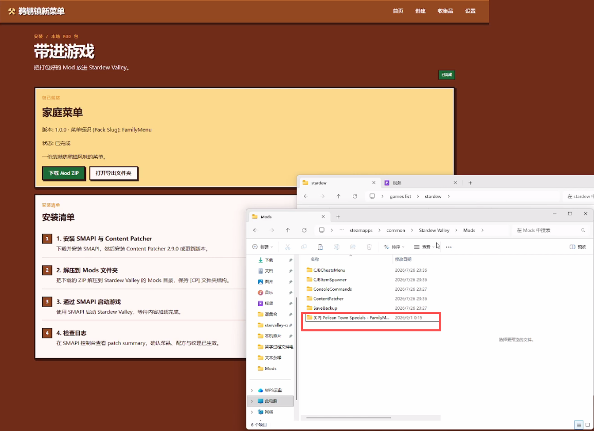

Your new dishes can now be crafted, obtained, and eaten in-game. Energy, health, price, and buffs use the values saved during creation.

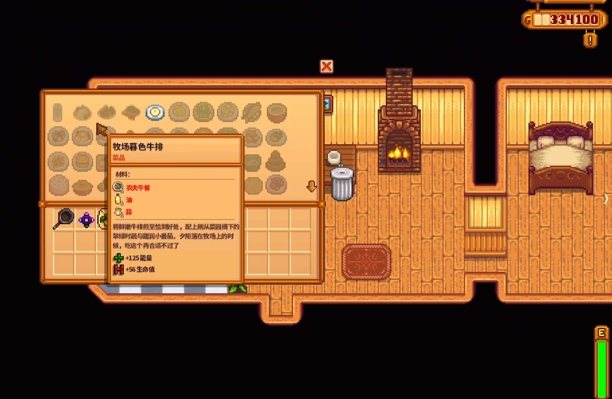

## FAQ

### Does a failed generation consume a trial use?

No. A trial use is deducted only after the entire generation completes successfully.

### What if the shared trial is unavailable?

You can retry immediately or configure your own service in Settings. If your personal service is already configured, the error panel lets you switch and continue creating.

### Will refreshing the page interrupt generation?

No. Reopen the draft to continue viewing the same task's progress.

### Why does Blueprint Mode say the preview needs an update?

The dish name, ingredients, or stats changed. Regenerate the preview before saving so the artwork reflects the latest version.

### Where is my API key stored?

The key is stored in the current Windows user's `PTS_OPENAI_API_KEY` environment variable. It is not written to drafts, logs, or diagnostic bundles. You can update or delete it from Settings at any time.

### Which operating systems are supported?

The desktop release currently supports 64-bit Windows 10 and Windows 11. Native macOS and Linux installers are not available yet.

## Report an issue

When opening a [GitHub issue](https://github.com/ConstantlyGrowup/pelican-town-specials-stardew-mod/issues), please include:

- What you were trying to do.
- The error code or message shown in the app.
- Whether you can generate a diagnostic bundle from Settings.

Never post your API key publicly.

Third-party licenses are listed in `THIRD_PARTY_NOTICES.txt` inside the release package.
