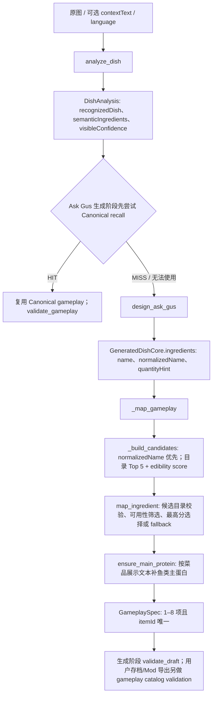

# M14 Task 62｜原料映射问题定位

| 字段 | 值 |
|---|---|
| 合同 | `m14-task62-ingredient-diagnosis-v1` |
| 目录 | `stardew-1.6.15-v1`（游戏版本 `stardew-1.6.15`；808 条目、253 个可作原料） |
| 目录 SHA-256 | `4D07E9B3EE45670543C1BDCFFA69F84CC2FB2829C4DB4CF2BEFD273B36374E2B` |
| 证据类型 | 当前源码静态追踪 + 真实版本化目录上的确定性测试 |
| 结论边界 | 机制复现；不是用户行为归因、Provider 事故报告或正式准确率基线 |

## 结论

Ask Gus 当前不是把完整游戏物品表交给模型选择 ID。模型先输出现实语义原料文本；应用再对每个原料用本地 Stardew 1.6.15 目录检索最多 5 个候选，并按目录可食用度重新评分，选择最高分的合法 `itemId`。因此，当前链路的确定性风险主要在语义词到目录候选的检索与排序；`itemId` 合法并不等于现实原料映射合理。

真实代码中存在两个可独立复现的反例：`Carp` 的正确目录项 `142` 已出现在 Top 5，但可食用度加权后选择了语义上不同的 `209 Carp Surprise`；`cherry tomatoes` 只检索到 `638 Cherry`，遗漏 `256 Tomato`。中文查询 `樱桃番茄` 则没有候选，会触发固定兜底。另有非法候选被映射器明确拒绝的防御性测试。

这些结果来自本地目录和确定性函数，不包含真实用户 Query、图片、模型输出或 Provider 调用。它们说明当前实现机制可能产生何种结果，不证明某个真实用户遇到了这些结果，也不说明 Provider 已发生故障。

## 当前代码路径



1. `analyze_dish()` 的视觉分析响应使用 `DishAnalysis`。其 `semanticIngredients` 包含 `name`、`normalizedName`、`visibleConfidence` 和可选数量提示；这些是菜品分析结果，不是最终游戏 `itemId`。
2. Ask Gus 的 `GAMEPLAY_DESIGN` 阶段先尝试 Canonical 召回。未命中或 Canonical 数据不能通过校验时，`design_ask_gus()` 将 DishAnalysis 序列化进提示，再返回 `GeneratedDishCore`。后者有自己的 `ingredients` 列表，每项为 `name`、`normalizedName`、`quantityHint`。实际映射使用这一份菜谱语义列表；视觉分析原料只通过设计提示间接影响它。
3. `INGREDIENT_MAPPING` 对非 Canonical 结果调用 `_map_gameplay()`。它逐项使用 `_build_candidates()`，输入优先取 `normalized_name`，为空时才取 `name`；然后调用 `VanillaCatalog.search_ingredients(..., limit=5)`。
4. 当前目录搜索依次按 ID、精确 alias、前缀、CJK 子串和 token overlap 排序，且先过滤 `usableAsIngredient`。`_build_candidates()` 再对 Top 5 按检索位置给递减基础分，并乘以 `1 + edibility / Top5 edibility sum`（无可用度时按 0 处理；总和为 0 时使用 1）。该分数可使后排但高可食用度的条目超过精确/靠前候选。
5. `map_ingredient()` 对候选对象类型、有限分数与 `catalog.require(item_id)` 做防御性检查，再排除不可用项并按分数降序、ID 稳定顺序选择。无候选或候选都不可用时，才走 fallback；通常优先返回未被使用的 Egg `176`。成功项的显示名来自当前语言的目录字段，数量固定为 1，且写入目录版本和 `mappingReason`。
6. `_map_gameplay()` 把已映射 ID 记入 `used_item_ids`，但 `map_ingredient()` 仅在 fallback 选择时使用该集合，正常候选选择不会排除已用 ID。若正常候选重复，构造 `GameplaySpec` 时的唯一 ID 约束会拒绝整个对象；这不是当前 mapper 内部的去重选择。
7. 完成逐项映射后，`ensure_main_protein()` 扫描菜名、分类、描述、标签和 Gus 评论中的中英文鱼类关键词。若文本提到海鲜而已映射项中没有游戏鱼类类别 `-4`，它尝试再次检索并插入一项鱼类；不足 8 项时前置插入，满 8 项时仅替换首个 fallback。这个后置守卫基于展示文本，不等同于原料语义检索，也可能改变 `_build_candidates()` 选出的最终清单。
8. `GameplaySpec` 在生成阶段负责 1–8 条以及 `itemId` 不重复等领域约束；随后 `RESULT_VALIDATION` 运行 `validate_draft()`，它不做原版目录语义校验。Canonical HIT 分支会立即运行 `validate_gameplay()`；Ask Gus 新结果在存档资格检查及 Mod 导出验证时运行 `validate_gameplay()`，校验目录成员、目录版本、类别与 `usableAsIngredient`。这些规则保证结构/目录合法性，不能判断一个合法候选是否符合现实菜谱逻辑。

核心位置：

- Ask Gus 模型边界：[`contracts.py`](../../backend/src/pelican_town_specials/providers/contracts.py) 中 `DishAnalysisRequest`、`AskGusDesignRequest`、`SemanticRecipeIngredient`、`GeneratedDishCore`；实际调用在 [`openai_compatible.py`](../../backend/src/pelican_town_specials/providers/openai_compatible.py) 的 `analyze_dish()` 与 `design_ask_gus()`。
- 候选生成与映射：[`orchestrator.py`](../../backend/src/pelican_town_specials/generation/orchestrator.py) 的 `_map_gameplay()`、`_build_candidates()` 和生成阶段处理；[`repository.py`](../../backend/src/pelican_town_specials/catalog/repository.py) 的 `search_ingredients()`；[`mapping.py`](../../backend/src/pelican_town_specials/catalog/mapping.py) 的 `map_ingredient()`、`ensure_main_protein()` 与 fallback。
- 领域和校验边界：[`dish.py`](../../backend/src/pelican_town_specials/domain/dish.py) 的 `GameplaySpec`；[`gameplay_rules.py`](../../backend/src/pelican_town_specials/catalog/gameplay_rules.py) 的 `validate_gameplay()`；存档检查在 [`drafts.py`](../../backend/src/pelican_town_specials/application/drafts.py)，Mod 导出检查在 [`validator.py`](../../backend/src/pelican_town_specials/mod_compiler/validator.py)。

### Canonical 与 Blueprint 边界

- Canonical HIT 复用此前已保存的 `GameplaySpec`，调用目录/玩法规则校验后跳过 `design_ask_gus()` 和 `_map_gameplay()`；Canonical 菜品召回是菜品级记忆路径，不是 M14 要定位的单条原料候选检索。Canonical miss 后才进入上述普通 Ask Gus 映射路径。
- Blueprint 通过独立入口由用户维护 `GameplaySpec`；其预览阶段从输入校验进入视觉 Brief、图标、预览和结果校验，不运行 Ask Gus 的 `GAMEPLAY_DESIGN` / `INGREDIENT_MAPPING` 阶段。Blueprint 的目录选择/提交边界不属于本次模型语义映射问题。

## 故障类型与可归因条件

| 类型 | 当前可见信号 | 可以判定什么 | 不能据此判定什么 |
|---|---|---|---|
| 上游视觉/语义错误 | `DishAnalysis` 的识别名或语义原料不符合原图；或者 `GeneratedDishCore.ingredients` 的现实名称/规范名已偏离菜意 | 有真实输入、阶段输出与用户/评测标签时，可定位偏差发生在视觉分析还是文本设计输出 | 本地目录测试没有原图或 Provider 输出，不能把候选机制样本说成模型幻觉、真实用户反馈案例或 Provider 缺陷。`visibleConfidence` 当前也不作为 `_build_candidates()` 的过滤/排序信号 |
| 检索遗漏/候选不足 | `search_ingredients()` 的返回没有合理目录项，或 `limit=5` 截断合理项；空结果触发 fallback | 可由冻结查询和本地目录重跑，判断候选是否漏失、排名是否截断 | Top 5 中没有合理项并不等于目录没有合理物；单次空结果不是正式 Recall@K/准确率统计 |
| 排序/选择错误 | 合理项已在候选内，但 `_build_candidates()` 的分数顺序或 `map_ingredient()` 的最高分选择偏向不合理的合法项 | 可从相同目录、查询、候选分数确定性复现 | 目录成员合法、排序分数高或 `mappingReason` 成功都不能证明现实原料逻辑正确 |
| 合法性拒绝 | `catalog.require()` 找不到 ID 时抛 `PTS_VALIDATION_INGREDIENT_ID_UNKNOWN`；已有但不可食用候选不会映射，候选空时 fallback | 可确认越界 ID 被拒绝，且 `validate_gameplay()` 会检查目录成员、版本、类别和可用性 | 正常 `_build_candidates()` 直接产出目录中的可用项，因而人为注入 `NotReal` 是防御边界测试，不是模型选择 ID 或 Provider 返回非法 ID 的证据 |
| 后置鱼类守卫 | `_dish_text()` 命中海鲜关键词，映射结果中无类别 `-4`，可能追加或替换 fallback | 可检查守卫是否按其既有规则介入最终输出 | 守卫介入不表示上游候选搜索正确，也不能把守卫产物当作原始映射器命中 |
| fallback | 无候选或没有可用候选时，`mappingReason` 以 `catalog fallback` 开始；首选 Egg ID `176` | 可以识别映射链路没有候选并走了兜底 | 兜底项只是确定性占位，不是该现实原料的合理对应；Task 64 的主准确率分母按计划排除兜底项 |

## 确定性样本

以下样本由新增专用测试在本地目录 `resources/catalogs/stardew-1.6.15/vanilla-ingredients.json` 上直接运行。输出不依赖网络、Provider 或外部模型。分数为 `_build_candidates()` 的实际数值，保留 5 位小数供复核。

| Query / 注入候选 | 检索 / 评分结果 | 最终机制结果 | 说明 |
|---|---|---|---|
| `Carp` | Top 5：`142 Carp`（edibility 5，score `1.06173`）、`209 Carp Surprise`（36，`1.15556`）、`269 Midnight Carp`（20，`0.74815`）、`682 Mutant Carp`（10，`0.44938`）、`901 Radioactive Carp`（10，`0.22469`） | `map_ingredient()` 选择 `209 Carp Surprise` | `142 Carp` 精确匹配且仍在候选中，但加权后 `209` 得分更高。它是排序/打分机制反例；这里以 `Carp` 指原版鲤鱼原料的确定性标签判断逻辑差异，不外推真实菜品错误率。若最终菜名文本包含 `carp`，鱼类守卫还可能另行插入 `142`，故表中结果特指守卫前单原料映射。 |
| `cherry tomatoes` | Top 5 仅 `[638 Cherry]`；`256 Tomato` 未入选 | 映射为 `638 Cherry` | token overlap 对复数 `tomatoes` 没有词干归一；返回的樱桃条目不代表番茄。该结果展示候选召回/词项处理边界。 |
| `樱桃番茄` | Top 5 为空 | `_build_candidates()` 为空；`map_ingredient()` fallback 为 `176`，`mappingReason` 标识 catalog fallback | 该复合中文名称没有对应 alias 或连续子串命中。目录中存在宽泛的番茄条目 `256`，但本次查询没有召回它。 |
| `NotReal`（确定性注入） | 显式向 mapper 传入 `CatalogCandidate(item_id="NotReal", score=1.0)` | 抛 `PTS_VALIDATION_INGREDIENT_ID_UNKNOWN`，HTTP 422、不可重试 | 验证 ID 目录校验边界。正常搜索不会产生这个候选，因此不归因于模型/Provider。 |

完整可执行断言见 [`test_task62_diagnosis.py`](../../backend/tests/catalog/test_task62_diagnosis.py)。这些样本用于展示机制与后续 Query 集设计的风险类型，不形成分子/分母、菜品级准确率、Recall@K 或前后对比结论。正式集合及标签应在 Task 64 运行旧方案前冻结。

## 后续最小改造接缝与保留约束

后续原料候选检索的最小接缝位于 `generation/orchestrator.py::_build_candidates()`：它负责把现实语义名称转成目录候选和当前分数；`_map_gameplay()` 是该候选提供器的调用处。后续方案可以在这里替换/改进候选来源和排序输入，并继续把目录候选交给 `map_ingredient()` 做最后校验及稳定领域构造。Task 62 不决定候选数量、模型、索引形式、存储或部署方案，这些属于 Task 63。

任何后续修改均应保留：

- `VanillaCatalog` 的版本化 1.6.15 身份与合法 itemId 来源；最终 `displayName` 从目录双语字段生成，而非信任模型文本。
- `map_ingredient()` 对候选结构、有限分数、目录成员和 `usableAsIngredient` 的检查；正常候选与 fallback 的语义必须可区分。
- `_map_gameplay()` 的逐语义原料映射边界、整体最多 8 项约束，以及 `GameplaySpec` 的 itemId 唯一性。当前 `used_item_ids` 只约束 fallback；正常候选去重是已观察到的独立限制，未来如要改变应在后续实现合同中明确。
- `ensure_main_protein()` 是映射后的鱼类一致性守卫，可能修改最终 ingredients；任何前后实验应分别保留 mapper 候选/选择与守卫后的最终输出。
- Canonical HIT/Blueprint 不属于 Ask Gus 语义映射分支；本 Task 不修改其行为或重新定义其边界。

## 验证命令

从仓库根目录运行：

```powershell
python -m pytest backend/tests/catalog/test_task62_diagnosis.py -q -p no:cacheprovider --basetemp output/m14-task62/pytest-focused
python -m pytest backend/tests/catalog/test_mapping.py backend/tests/catalog/test_catalog.py -q -p no:cacheprovider --basetemp output/m14-task62/pytest-regression
git diff --check
```

`output/m14-task62/` 为本次测试临时目录，不属于交付文件。
